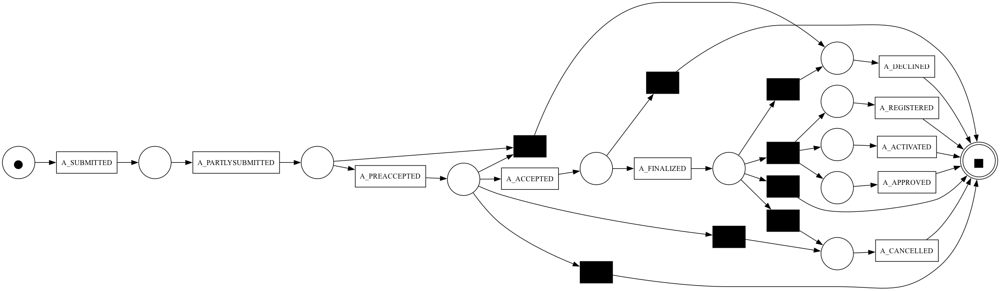
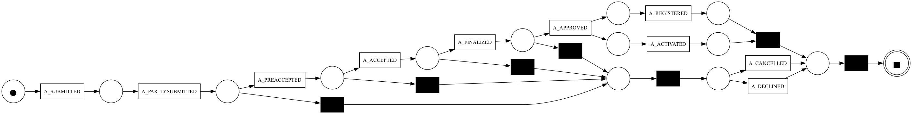
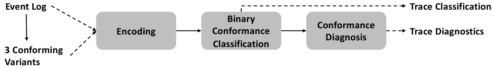

# Towards-Model-Free-Conformance-Checking

### Usage of this repository
This repository is supposed to help to reproduce the work in the paper "Towards Model-Free Conformance Checking: Assessing Trace Conformance Based on Few Annotated Variants". With
this work, we aim to move towards model-free conformance checking and enable managers to apply conformance checking even if no process model is available. We evaluated various anomaly detection algorithms and used the heuristic miner algorithm as baselines. Additionally, we proposed a novel approach that uses three conforming input traces for conformance checking.

_**data:**_
- contains all the event logs, process models and input traces used

_**notebooks:**_
- contains all the experimental results for approaches BINet[2], DAPNN[1], H+A, OHE, and EMB

### Anomaly Detection Baseline (DAPNN, BINet)
Although the intended purpose of Anomaly Detection is not to determine the trace conformance, those traces classified anomalous may be also deviating. Therefore, we compare our approach to **BINet**[2] in the version v1. We also use the anomaly detection approach **DAPPN**[1] in version FIX-98. This version refines BINet in several ways. We implemented these versions based on the authors' conceptual descriptions provided in their papers. However, our implementations may differ slightly, as they have been adapted to be applicable for our specific use case of conformance checking. Additionally, we also evaluated modified versions of BINet_v1 and DAPNN_FIX-98 that focus exclusively on identifying anomalies—specifically, deviations in behavior based on the activity sequence—rather than predicting the next event. This provides a baseline for our approach, which labels traces as conforming or deviating solely based on the activity sequence. Here's a brief overview:
- **BINet_v1:** Original approach by Nolle et al. [2]
- **BINet_v1-NextActivity:** Modified version of BINet_v1, predicting only the next activity based on previous activities
- **DAPNN_FIX-98:** Original approach by Lahann et al. [1]
- **DAPNN_FIX-98-NextActivity:** Modified version of DAPNN_FIX-98, predicting only the next activity based on previous activities

### Process Discovery Baseline (H+A)
An intuitive approach to model-free conformance checking would be first to discover a process model and then perform traditional trace alignments. We use the **heuristics miner** with default noise parameters to discover a process model from the event log and use the PM4Py trace alignment implementation to perform model-free conformance checking. Some discovered process models exhibit poor semantic quality as they fail to adequately capture the intended behavior. This results in the inability to accurately reconstruct inserted and skipped activities, leading to ineffective detection of model deviations. We visualized this for event log 12A:

  

    
    
Fig. 1: Discovered Model 12A

  

  

    
    
Fig. 2: Ground Truth Model 12A

  

### Our Approach
In this paper, we introduce a novel approach to model-free conformance checking based on unsupervised machine learning techniques that does not rely on a predefined process model. Instead, it determines conformance solely based on the annotation of three trace variants as conform. The approach classifies all traces in an event log as either conforming or deviating by applying unsupervised clustering to the distances of the traces to these three variants. In addition, it is able to determine the trace fitness as well as individual deviations in the form of inserted and skipped events, meaning that it generates the same diagnostics as alignments. 

  

    
    
Fig. 1: Discovered Model 12A

### References
[1] Lahann, J., Pfeiffer, P., Fettke, P.: Lstm-based anomaly detection of process instances: benchmark and tweaks. In: ICPM. pp. 229–241. Springer (2022)

[2] Nolle, T., Luettgen, S., Seeliger, A., Mühlhäuser, M.: Binet: Multi-perspective business process anomaly classification. Inf Syst 103, 101458 (2019)

### Python packages
python version:	3.9
- pm4py
- scipy
- sklearn
- tensorflow
- numpy
- pandas
